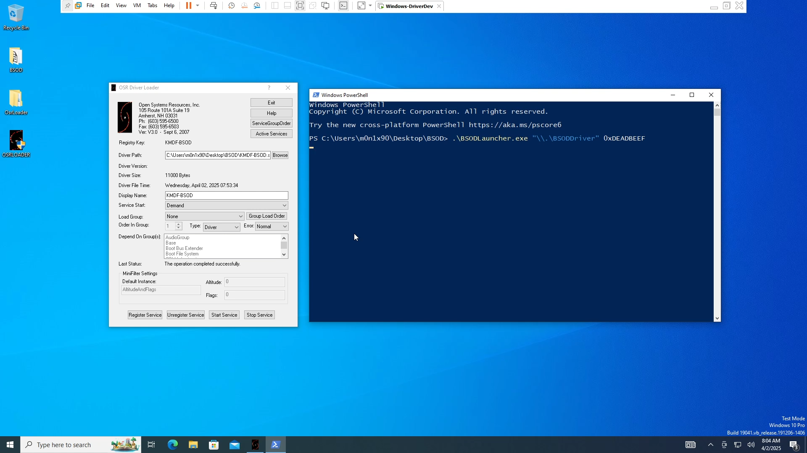
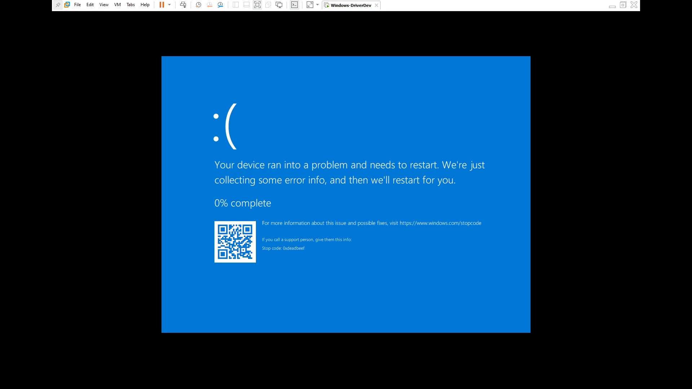

# BSOD

## Overview

This repo **BSOD** is a Windows kernel-mode driver and command-line interface (CLI) tool that allows users to trigger a **Blue Screen of Death** (BSOD) with a custom stop code via `KeBugCheckEx()` function. This tool is made for fun and development exercise to practice Windows Driver Development and Kernel Debugging.

## Features

- **Custom Stop Code**: Invoke a BSOD with a user-defined stop code for specific error simulation.
- **User -Friendly CLI**: Simple command-line interface for easy interaction.
- **Debugging Aid**: Helps in diagnosing system issues by providing specific stop codes.

## Prerequisites

- Windows operating system (Windows 10 or later recommended)
- Visual Studio with Windows Driver Kit (WDK) installed
- Administrative privileges for driver installation

## Important Note

Use with Caution: Triggering a BSOD will cause your system to crash. Ensure you save all work and understand the implications of using this tool.
Testing Environment: It is recommended to use this tool in a controlled testing environment, such as a virtual machine.

## POC

## License

This project is licensed under the MIT License. See the LICENSE file for details.
